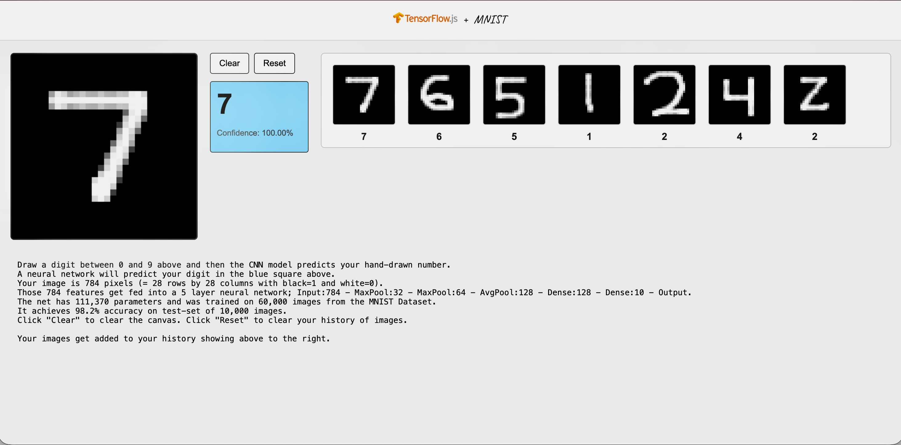

<div align="center">

<h1 style="
  background: linear-gradient(90deg, #f59e0b, #ef4444);
  -webkit-background-clip: text;
  color: transparent;
  font-weight: 700;
">
MNIST Draw Digit Recognition App
</h1>

<p style="max-width: 700px; margin: auto; color: #444;">
A lightweight web application that lets you draw a handwritten digit and get a real-time prediction from a neural network trained on the MNIST dataset.
</p>

</div>

---

## Overview

This project is a simple web-based digit recognizer.  
You draw a number (0–9) on a canvas and a trained neural network predicts what you wrote.

It consists of:
- A browser-based drawing interface  
- A Flask backend that runs a trained Keras model  

---

## How it works

1. You draw a digit on the canvas.
2. The drawing is converted into a 28×28 grayscale image.
3. The pixel data is sent to a Flask API.
4. The neural network predicts the digit.
5. The predicted value and confidence are returned and displayed.

The model is trained on the MNIST handwritten digit dataset and saved in `.keras` format.


---

## Technologies Used

**Frontend**
- HTML  
- CSS  
- JavaScript  
- HTML5 Canvas  

**Backend**
- Python  
- Flask  
- NumPy  
- Keras  

---

## Project Structure

```text
project-folder/
│
├── server.py                 Flask backend
├── mnist_classifier.keras    Trained model
├── canvasDraw.html           Frontend UI
├── style.css                 Styling
├── script.js                 Canvas logic and API calls
```

---

**Running the project**
```
pip install -r requirements.txt
python server.py
backend runs on http://127.0.0.1:5000
open index.html in your browser
```

**Contribution**
- Clone the repo : git clone https://github.com/sankalp6115/MNIST-Draw.git
- git remote add upstream https://github.com/sankalp6115/MNIST-Draw.git
- Make your changes in a new branch
- git checkout -b [branch-name]
- git add .
- git commit -m "A concise description of your changes"
- git push origin [branch-name]
- Create a pull request


